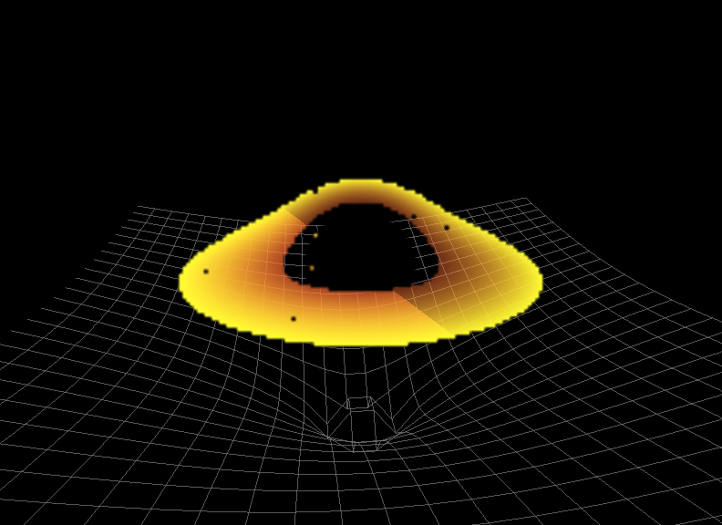
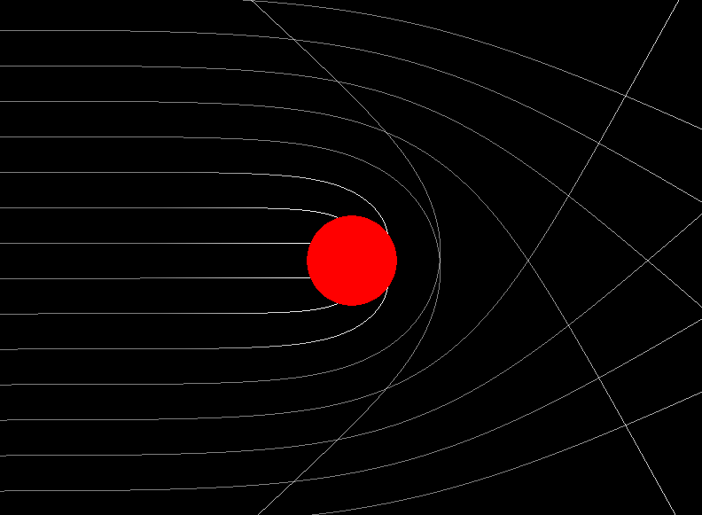
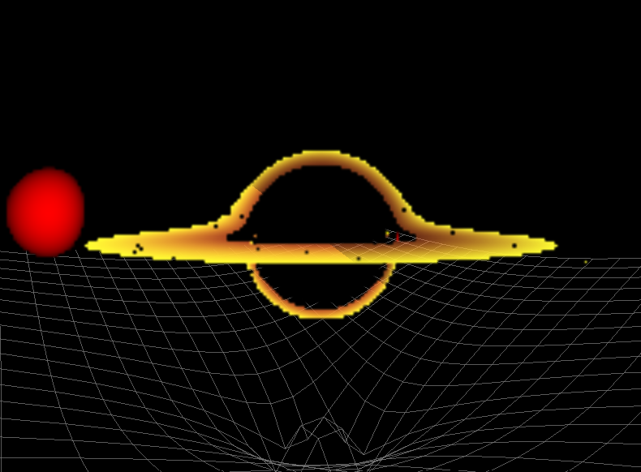
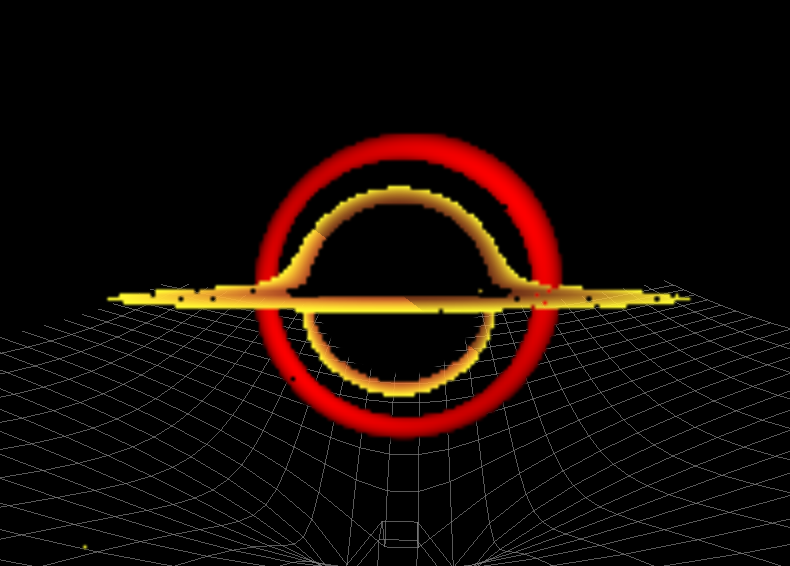

# Black Hole Simulation

An interactive C++ and OpenGL simulation exploring gravitational lensing, null-geodesic ray tracing in curved spacetime, an accretion disk, and gravitational interactions around a supermassive black hole.



This project provides real-time visualizations of how extreme mass warps surrounding spacetime and bends light rays. It includes an interactive 3D simulation accelerated by GPU compute shaders, an interactive 2D gravitational lensing simulator, and a standalone CPU-based geodesic reference prototype.

---

## Features

- **GPU-Accelerated 3D Geodesic Ray Tracing**: Computes curved light paths (null geodesics) in parallel for each pixel using OpenGL 4.3 compute shaders.
- **Accretion Disk Visualization**: Real-time rendering of a luminous accretion disk on the equatorial plane with radial color gradients.
- **Warped 3D Spacetime Grid**: Dynamic wireframe mesh visualizing gravitational potential wells and spatial curvature (Flamm's paraboloid) around massive bodies.
- **2D Gravitational Lensing**: Interactive 2D light beam deflection demonstrating event horizon capture and photon trajectories around an adjustable black hole.
- **N-Body Gravitational Dynamics**: Pairwise gravitational attraction between celestial bodies and the central black hole.
- **Interactive Camera System**: Smooth orbital camera navigation with rotation and zoom controls.
- **CPU Reference Prototype**: Standalone multi-threaded CPU implementation utilizing OpenMP for numerical validation and study.

---

## 2D Gravitational Lensing

The 2D simulation (`black_hole_lensing_2d`) demonstrates how light rays emitted from a light source bend as they pass near a black hole.



### Physics & Algorithm
- **Ray Generation**: An array of parallel light rays is initialized on the left edge of the screen, traveling horizontally toward the right.
- **Relativistic Bending**: Each ray is tracked in polar coordinates $(r, \phi)$ centered on the black hole. The ray's trajectory is updated using the geodesic equations derived from the Schwarzschild metric.
- **Numerical Integration**: Equations of motion are integrated step-by-step using the Runge-Kutta 4th Order (RK4) method.
- **Event Horizon Capture**: Light rays that pass within the Schwarzschild radius ($r \le r_s = \frac{2GM}{c^2}$) are captured and terminated inside the black hole.
- **Fading Trails**: The historical trajectory of each ray is stored and rendered with alpha-fading line segments.
- **Interactive Controls**: Users can drag the black hole across the screen and dynamically increase or decrease its mass using the mouse scroll wheel.

---

## 3D Simulation

The main 3D application (`black_hole_simulation_3d`) renders a fully interactive 3D scene containing the supermassive black hole Sagittarius A*, an accretion disk, orbiting celestial objects, and an overlaid spacetime grid.



### Scene Components
- **Supermassive Black Hole**: Modeled after Sagittarius A* ($M \approx 8.54 \times 10^{36}\text{ kg}$), with its Schwarzschild radius defining the event horizon.
- **Light-Ray / Geodesic Tracing**: For every pixel, a ray is cast from the camera into the scene and traced through curved spacetime via a GPU compute shader.
- **Accretion Disk**: Modeled as an equatorial disk spanning from $2.2 r_s$ (just outside the event horizon) to $5.2 r_s$.
- **Celestial Bodies / Stars**: Spherical objects rendered with diffuse lighting that can interact gravitationally with the system.
- **Orbital Camera**: Orbits smoothly around the center of mass using spherical coordinates (azimuth, elevation, radius).



### Spacetime Grid Representation
The spacetime grid is a 3D wireframe mesh embedded on the $X-Z$ plane. The vertical displacement ($Y$-axis) of the grid vertices is depressed near massive bodies according to Flamm's paraboloid geometry:

$$\Delta y \propto 2 \sqrt{r_s (r - r_s)}$$

> **Note**: The grid is an intuitive geometric embedding diagram designed to visualize the gravitational potential well and spatial curvature. It is not a complete representation of four-dimensional spacetime.

---

## How It Works

### Overall Pipeline

```
CPU Application
  │
  ├── Process User Input (Camera, Controls)
  ├── Compute N-Body Gravitational Physics (Newtonian)
  ├── Generate 3D Warped Spacetime Grid Mesh
  │
  └── Upload Uniform Buffer Objects (UBOs)
        ├── Camera UBO  (Binding 1: Position, Basis Vectors, FOV)
        ├── Disk UBO    (Binding 2: Inner/Outer Radii, Thickness)
        └── Objects UBO (Binding 3: Positions, Radii, Colors, Masses)
              │
              ▼
GPU Compute Shader (geodesic.comp)
  │
  ├── 16x16 Thread Workgroups (One Thread per Pixel)
  ├── Construct Primary Ray in Camera Space
  ├── March Ray in Curved Spacetime (RK4 Geodesic Integration)
  ├── Check Intersections (Event Horizon, Accretion Disk, Stars)
  │
  └── Write Color to 2D Texture (imageStore)
        │
        ▼
OpenGL Render Pass
  ├── Draw Fullscreen Quad (Compute Texture Output)
  └── Overlay 3D Spacetime Grid Lines (Alpha Blending)
        │
        ▼
Screen Display
```

### CPU Side
- **Input & Camera Management**: Converts mouse drag and scroll events into spherical coordinate updates, computing orthonormal camera basis vectors (`camForward`, `camRight`, `camUp`).
- **N-Body Dynamics**: Computes pairwise Newtonian gravitational attraction between objects when enabled.
- **Grid Generation**: Calculates vertex heights for the wireframe grid mesh based on the distances to all massive bodies.
- **Data Dispatch**: Serializes scene and camera parameters into `std140`-aligned Uniform Buffer Objects (UBOs).
- **Composition**: Draws the ray-traced background texture to a fullscreen quad, then renders the 3D spacetime grid on top using alpha blending.

### GPU Side (`geodesic.comp`)
- **Parallel Ray Dispatch**: The compute shader organizes threads into `16x16` workgroups. Each thread computes the path of a photon corresponding to one pixel on the screen.
- **Why GPU?**: A single frame requires tracing thousands of rays across tens of thousands of integration steps. Parallel GPU threads allow these calculations to run concurrently in real time.

### Geodesic Ray Tracing
In general relativity, light follows **null geodesics** (the shortest/straightest possible paths through curved spacetime). 

Around a non-rotating Schwarzschild black hole, the trajectory of a light ray is governed by the second-order differential equations:

$$\frac{d^2 r}{d\lambda^2} = -\frac{r_s}{2r^2}\left(1 - \frac{r_s}{r}\right)\left(\frac{dt}{d\lambda}\right)^2 + \frac{r_s}{2r^2\left(1 - \frac{r_s}{r}\right)}\left(\frac{dr}{d\lambda}\right)^2 + r\left[\left(\frac{d\theta}{d\lambda}\right)^2 + \sin^2\theta\left(\frac{d\phi}{d\lambda}\right)^2\right]$$

$$\frac{d^2\theta}{d\lambda^2} = -\frac{2}{r}\frac{dr}{d\lambda}\frac{d\theta}{d\lambda} + \sin\theta\cos\theta\left(\frac{d\phi}{d\lambda}\right)^2$$

$$\frac{d^2\phi}{d\lambda^2} = -\frac{2}{r}\frac{dr}{d\lambda}\frac{d\phi}{d\lambda} - 2\frac{\cos\theta}{\sin\theta}\frac{d\theta}{d\lambda}\frac{d\phi}{d\lambda}$$

The compute shader integrates the 6-element state vector $[r, \theta, \phi, dr, d\theta, d\phi]$ using the **Runge-Kutta 4th Order (RK4)** numerical method across step size $\Delta\lambda = 10^7\text{ m}$.

### Accretion Disk Detection
The accretion disk is defined on the equatorial plane ($y = 0$). As the light ray advances, the shader checks whether the ray crossed the equatorial plane between the inner radius $r_1$ and outer radius $r_2$. If crossed, the shader assigns an emission color based on radial distance.

### Gravitational Dynamics
The orbital movement of celestial bodies is computed using pairwise Newtonian gravitation:

$$\vec{F}_{12} = G \frac{m_1 m_2}{r^2} \hat{r}_{12}$$

> **Note**: While light rays are traced using general-relativistic geodesic equations, object-to-object orbital physics is calculated using Newtonian gravity.

---

## Physics & Mathematical Model

This simulation combines general relativity for photon trajectories with classical mechanics for orbital motion.

### 1. Schwarzschild Metric
The simulation assumes a static, spherically symmetric, non-rotating black hole described by the **Schwarzschild metric** in spherical coordinates $(t, r, \theta, \phi)$:

$$ds^2 = -\left(1 - \frac{r_s}{r}\right)c^2 dt^2 + \frac{dr^2}{1 - \frac{r_s}{r}} + r^2(d\theta^2 + \sin^2\theta d\phi^2)$$

This metric describes how spacetime geometry is curved by a central mass.

### 2. Schwarzschild Radius
The characteristic length scale of the black hole is the **Schwarzschild radius** $r_s$:

$$r_s = \frac{2GM}{c^2}$$

In the simulation, $r_s$ defines the spherical boundary of the **event horizon**—any light ray reaching $r \le r_s$ is captured and terminated.

### 3. Geodesic Equation
Light travels along **null geodesics** ($ds^2 = 0$) through curved spacetime, governed by the general-relativistic geodesic equation parameterized by an affine parameter $\lambda$:

$$\frac{d^2 x^\mu}{d\lambda^2} + \Gamma^\mu_{\alpha\beta}\frac{dx^\alpha}{d\lambda}\frac{dx^\beta}{d\lambda} = 0$$

- Light follows null geodesics representing the straightest possible paths in curved spacetime.
- $\Gamma^\mu_{\alpha\beta}$ represents the **Christoffel symbols**, which encode how the curved coordinate geometry affects the trajectory.
- The simulation does not numerically calculate the full tensor equation directly at runtime; the relevant equations are analytically expanded into spherical-coordinate geodesic equations implemented in the CPU prototype and GPU compute shader.

### 4. Coordinate Geodesic Equations
The expanded second-order differential equations for $r$, $\theta$, and $\phi$ are the equations implemented in `shaders/geodesic.comp` and `src/geodesic_cpu.cpp` (documented in detail in the [Geodesic Ray Tracing](#geodesic-ray-tracing) section above).

### 5. Numerical Integration
Because these non-linear differential equations do not have a simple closed-form solution for arbitrary ray paths, the simulation numerically advances each ray step-by-step using the **Runge-Kutta 4th Order (RK4)** method. The GPU compute shader integrates the 6-element state vector:

$$\left[r,\, \theta,\, \phi,\, \frac{dr}{d\lambda},\, \frac{d\theta}{d\lambda},\, \frac{d\phi}{d\lambda}\right]$$

### 6. Classical N-Body Dynamics
The project distinctly separates two physics models:
- **Light propagation**: General-relativistic geodesic equations through curved spacetime.
- **Celestial-body motion**: Classical Newtonian gravity for orbiting masses:

$$\vec{F}_{12} = G \frac{m_1 m_2}{r^2} \hat{r}_{12}$$

### 7. Visualization Note
The warped 3D grid uses **Flamm's paraboloid** as an intuitive visualization of spatial curvature and gravitational potential wells. As noted in the [Spacetime Grid Representation](#spacetime-grid-representation) section, this is an embedding diagram representing spatial geometry and is not a complete four-dimensional spacetime representation.

---

## CPU vs GPU Geodesics

The repository contains two distinct implementations of 3D geodesic ray tracing:

| Feature | `shaders/geodesic.comp` (GPU) | `src/geodesic_cpu.cpp` (CPU Reference) |
| :--- | :--- | :--- |
| **Execution** | GPU Compute Shader (OpenGL 4.3) | CPU Multi-Threaded (OpenMP) |
| **Role** | Main 3D simulation ray tracer | Standalone validation prototype & reference |
| **Parallelism** | Massively parallel (thousands of GPU cores) | Multi-core CPU threads (`#pragma omp parallel for`) |
| **Integration Target** | Compiled into `black_hole_simulation_3d` | Standalone source file (not built by default) |
| **Features** | Accretion disk, stars, UBO data, real-time | Black hole shadow verification, basic ray march |

---

## Controls

### 3D Simulation (`black_hole_simulation_3d`)

| Input | Action |
| :--- | :--- |
| **Left Mouse Click + Drag** | Orbit camera around the black hole |
| **Mouse Scroll Wheel** | Zoom in / Zoom out (adjust orbital distance) |
| **`G` Key / Right Mouse Click** | Toggle N-body gravity simulation ON / OFF |

### 2D Simulation (`black_hole_lensing_2d`)

| Input | Action |
| :--- | :--- |
| **Left Mouse Click + Drag** | Move black hole position across the screen |
| **Mouse Scroll Wheel** | Increase / decrease black hole mass ($M$ and $r_s$) |
| **Spacebar** | Reset light rays back to the left boundary |

### CPU Reference (`geodesic_cpu`)

| Input | Action |
| :--- | :--- |
| **Left Mouse Click + Drag** | Orbit camera |
| **Shift + Left Mouse Drag** | Pan camera target |
| **Mouse Scroll Wheel** | Zoom in / Zoom out |
| **`G` Key** | Toggle straight Euclidean rays vs. curved geodesics |

---

## Project Structure

```
Blackhole/
├── src/
│   ├── black_hole_simulation_3d.cpp  # Main 3D simulation & OpenGL rendering
│   ├── black_hole_lensing_2d.cpp     # 2D gravitational lensing simulation
│   └── geodesic_cpu.cpp              # Standalone CPU geodesic reference prototype
│
├── shaders/
│   ├── geodesic.comp                 # GPU compute shader for 3D geodesic ray tracing
│   ├── grid.vert                     # Vertex shader for 3D warped spacetime grid
│   └── grid.frag                     # Fragment shader for 3D warped spacetime grid
│
├── assets/                           # Screenshots and documentation media
│   ├── black-hole-3d.png
│   ├── black-hole-star.png
│   ├── spacetime-grid.png
│   └── lensing-2d.png
│
├── CMakeLists.txt                    # CMake build configuration
├── .gitignore                        # Git ignore rules
├── .clangd                           # Language server configuration
└── glew32.dll                        # Windows GLEW runtime binary
```

---

## Requirements

### Main Simulations (2D and 3D)
- **C++ Compiler**: C++20 compliant (GCC/MinGW, Clang, or MSVC)
- **CMake**: Version 3.20 or newer
- **OpenGL**:
  - **OpenGL 4.3+** (Core Profile) for `black_hole_simulation_3d` (required for compute shaders)
  - **OpenGL 3.3+** for `black_hole_lensing_2d`
- **GLFW**: Version 3.x (windowing, input, and context management)
- **GLEW**: Version 2.x (OpenGL extension loader)
- **GLM**: Header-only mathematics library

### Standalone CPU Reference (`geodesic_cpu.cpp`)
- **OpenMP**: (Optional, recommended) For multi-threaded CPU ray tracing

---

## Building & Running

### 1. Clone the Repository
```bash
git clone https://github.com/rvrahul294/black-hole-simulation.git
cd black-hole-simulation
```

### 2. Configure with CMake
```bash
cmake -B build -G "MinGW Makefiles"
```
*(On Linux or macOS, omit `-G "MinGW Makefiles"` or use `-G Ninja` / `-G "Unix Makefiles"`).*

### 3. Build the Project
```bash
cmake --build build
```

This compiles two executables into the `build/` directory:
- `build/black_hole_simulation_3d`
- `build/black_hole_lensing_2d`

CMake automatically copies the `shaders/` directory and `glew32.dll` (on Windows) into the `build/` folder.

### 4. Run the Simulations

#### Run 3D Simulation:
```bash
./build/black_hole_simulation_3d
```

#### Run 2D Lensing:
```bash
./build/black_hole_lensing_2d
```

#### (Optional) Compile and Run CPU Reference:
```bash
g++ src/geodesic_cpu.cpp -o build/geodesic_cpu -lglew32 -lglfw3 -lopengl32 -lgdi32 -fopenmp
./build/geodesic_cpu
```

## Acknowledgment

This project is based on and developed from the original
[black_hole](https://github.com/kavan010/black_hole) project by kavan010.

The original project provided the foundation for the black-hole simulation,
including the core C++/OpenGL implementation and geodesic ray-tracing
approach.

This repository represents my own study and adaptation of the project,
including code organization, documentation, CMake/build improvements,
runtime asset handling, comments, screenshots, and other modifications
made while studying and extending the original implementation.